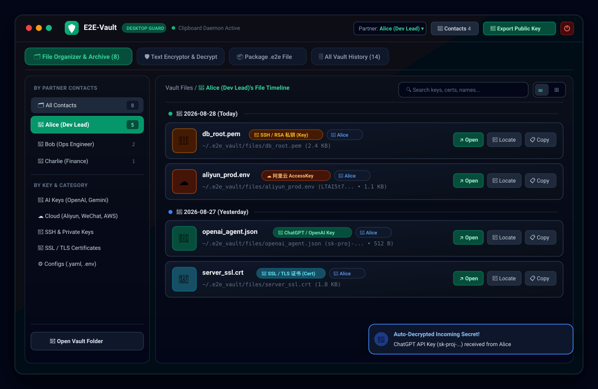
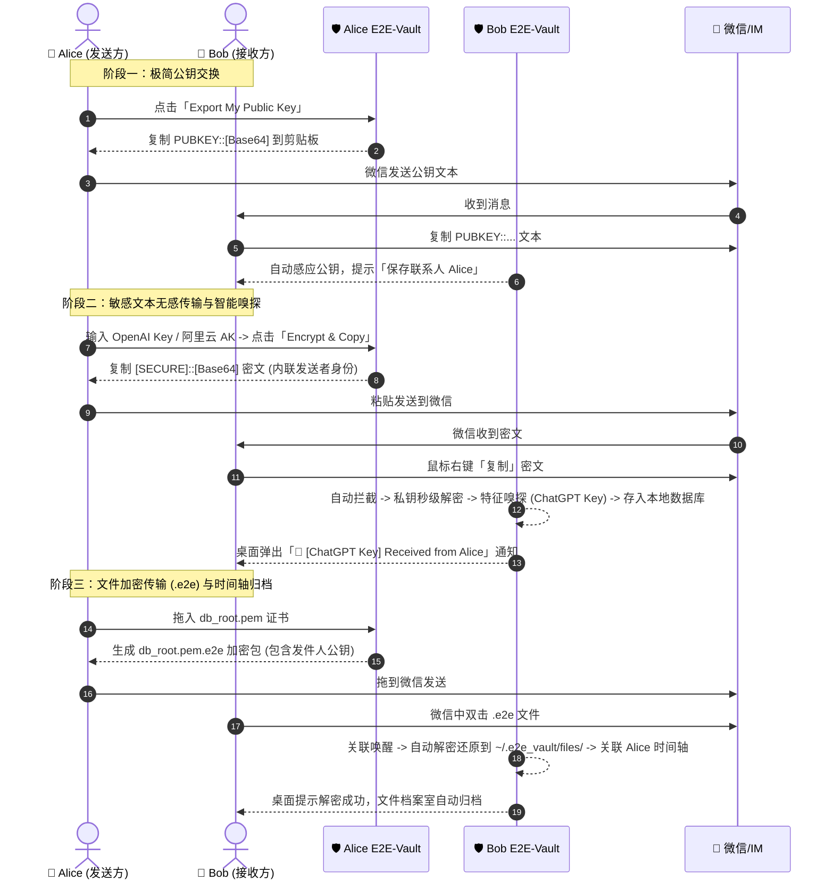

# 🛡️ E2E-Vault: Desktop End-to-End Encrypted Vault for Instant Messaging

<div align="center">

[](LICENSE)
[](#)
[](https://tauri.app)
[](https://www.rust-lang.org)
[](https://reactjs.org)
[](https://tailwindcss.com)

**一款专为微信、企业微信、钉钉等即时通讯工具设计的桌面端端到端加密（E2EE）保险库。**  
*A native, privacy-first desktop vault to seamlessly encrypt/decrypt sensitive text and credentials over untrusted IM channels.*

[中文文档](#-中文说明) | [界面预览 (UI Showcase)](#-界面直观预览-ui-preview) | [全网主流 Key 嗅探图谱](#-全网主流-key-本地特征嗅探图谱无需大模型) | [English Guide](#-english-guide) | [下载安装 (Releases)](https://github.com/bigbowl99/E2E-Vault/releases)

<br/>

<!-- App Visual UI Mockup -->


</div>

---

## 📸 界面直观预览 (UI Preview)

### 1. 🗂️ 文件档案整理中心（按联系人时间轴与 Key 分类）
```text
+---------------------------------------------------------------------------------------------------------+
| 🛡️ E2E-Vault   [DESKTOP GUARD] 🟢 Daemon Active     Partner: [Alice (Dev Lead) ▾]  [👥 Contacts 4] [🔑导出公钥] [⏻] |
+---------------------------------------------------------------------------------------------------------+
| [🗂️ File Organizer (8)]  [🛡️ Text Encryptor]  [📦 Package .e2e File]  [🗄️ All Vault History (14)]       |
+----------------------+----------------------------------------------------------------------------------+
| 📂 档案分类导航        | 📁 Vault Files / 👤 Alice (Dev Lead)'s File Timeline         [🔍 搜索 Key / 文件名...] [☰][⊞]|
|                      +----------------------------------------------------------------------------------+
| BY PARTNER CONTACTS  | 📅 2026-08-28 (Today)                                                            |
|  ├ 🗂️ All Contacts 8 |  ├─ 🔑 db_root.pem      [🔑 SSH/RSA 私钥]  [👤 Alice]  ~/.e2e_vault/files/db_root.pem    |
|  ├ 👤 Alice (选中) 5  |  │   └─ [↗ 打开] [📂 定位] [📋 复制路径] [🗑️ 删除]                                |
|  ├ 👤 Bob (Ops)   2  |  │                                                                              |
|  └ 👤 Charlie     1  |  └─ ☁️ aliyun_prod.env  [☁️ 阿里云 AccessKey] [👤 Alice]  (LTAI5t7... • 1.1 KB)           |
|                      |      └─ [↗ 打开] [📂 定位] [📋 复制路径] [🗑️ 删除]                                |
| BY KEY & CATEGORY    |                                                                                  |
|  ├ 🤖 AI Keys        | 📅 2026-08-27 (Yesterday)                                                        |
|  ├ ☁️ Cloud & Eco    |  ├─ 🤖 openai_agent.json [🤖 ChatGPT/OpenAI Key] [👤 Alice] (sk-proj-... • 512 B)       |
|  ├ 🔑 SSH Keys       |  │   └─ [↗ 打开] [📂 定位] [📋 复制路径] [🗑️ 删除]                                |
|  ├ 📜 SSL Certs      |  │                                                                              |
|  └ ⚙️ Configs & .env |  └─ 📜 server_ssl.crt   [📜 SSL/TLS 证书]   [👤 Alice]  ~/.e2e_vault/files/server.crt  |
|                      |      └─ [↗ 打开] [📂 定位] [📋 复制路径] [🗑️ 删除]                                |
| [📂 Open Vault Dir]  |                                                                                  |
+----------------------+----------------------------------------------------------------------------------+
|                                                          [🔐 自动解密通知: ChatGPT Key received from Alice!]     |
+---------------------------------------------------------------------------------------------------------+
```

---

## 🇨🇳 中文说明

### 🌟 为什么需要 E2E-Vault？
在日常团队协作与即时通讯中，我们经常需要在微信等普通聊天工具中发送密码、API Token、SSH 私钥、数据库配置等敏感信息。但明文发送存在巨大的泄漏与合规风险。

**E2E-Vault** 充当你的本地安全卫士：
- **无感秒级加解密**：后台实时监听剪贴板，复制到微信密文即自动秒级解密，弹出系统通知。
- **真正的端到端加密（Zero-Knowledge）**：基于椭圆曲线 **X25519** 密钥协商 + **AES-256-GCM** 认证加密，无需中心服务器，私钥仅保存在本地。
- **离线智能 Key 特征嗅探（无需大模型）**：秒级自动识别并归类 **ChatGPT、Gemini、Claude、DeepSeek、阿里云、腾讯云、微信支付、AWS、SSH 私钥、SSL 证书、数据库连接串** 等 30+ 种主流凭据。
- **联系人时间轴与文件整理中心**：自动绑定发件人，支持按联系人、按 Key 类别、按时间顺序查看历史收发的文件与秘钥，一键打开或在文件管理器中定位。
- **文件打包传输 (`.e2e`)**：支持证书、密钥及配置文件拖拽打包为 `.e2e` 加密格式，双击即可无感还原。
- **本地 SQLite 安全归档**：所有收发的机密文本与文件结构化存储在本地数据库中，支持秒级全文检索与多维筛选。

---

### 🚀 核心工作流



---

### 🔍 全网主流 Key 本地特征嗅探图谱（无需大模型）

E2E-Vault 采用类似 **Gitleaks / TruffleHog** 的纯本地确定性正则特征引擎，在收到文本或解密文件瞬间毫秒级自动打标，零延迟、零数据出境：

| 分类 | 平台 / 密钥类型 | 核心特征 (Pattern) | 自动识别标签 (Tag) |
| :--- | :--- | :--- | :--- |
| **🤖 AI 大模型** | **OpenAI / ChatGPT** | `sk-[a-zA-Z0-9]{20,}` 或 `sk-proj-[a-zA-Z0-9_-]{20,}` | `ChatGPT / OpenAI Key` |
| | **Google Gemini** | `AIzaSy[a-zA-Z0-9_-]{30,45}` | `Google Gemini API Key` |
| | **Anthropic Claude** | `sk-ant-api[0-9]{2}-[a-zA-Z0-9_-]{80,}` | `Claude API Key` |
| | **DeepSeek** | `deepseek` + `sk-[a-zA-Z0-9]{20,}` | `DeepSeek API Key` |
| | **Hugging Face** | `hf_[a-zA-Z0-9]{34,}` | `Hugging Face Token` |
| **🇨🇳 国内生态** | **阿里云 AccessKey** | `LTAI[a-zA-Z0-9]{16,24}` + Secret | `阿里云 AccessKey ID` |
| | **腾讯云 Secret** | `AKID[a-zA-Z0-9]{32,36}` | `腾讯云 SecretId` |
| | **微信开放/支付** | `wx[a-f0-9]{16}`、`apiclient_key.pem`、微信 32位 APIv3 密钥 | `微信生态 / 微信支付凭证` |
| | **百度智能云** | `ALTAK-[a-zA-Z0-9]{20,}` | `百度智能云 AccessKey` |
| | **飞书/钉钉/企微** | `cli_[a-z0-9]{16}` / `ding[a-z0-9]{16}` / `ww[a-z0-9]{16}` | `企业协同开放凭证` |
| **☁️ 国际云平台** | **AWS AccessKey** | `AKIA[0-9A-Z]{16}` 或 `ASIA[0-9A-Z]{16}` | `AWS AccessKey ID` |
| | **Google Cloud GCP** | JSON 包含 `"type": "service_account"` 与 `"private_key"` | `GCP Service Account` |
| | **Kubernetes** | YAML 包含 `apiVersion: v1` 与 `kind: Config` (Kubeconfig) | `K8s Kubeconfig` |
| **🐙 开发者平台** | **GitHub Token** | `ghp_[a-zA-Z0-9]{36}` 或 `github_pat_[a-zA-Z0-9_]{82}` | `GitHub Access Token` |
| | **GitLab Token** | `glpat-[a-zA-Z0-9\-_]{20,}` | `GitLab Access Token` |
| | **NPM Token** | `npm_[a-zA-Z0-9]{36}` | `NPM Access Token` |
| **💬 Bot & 支付** | **Telegram Bot** | `[0-9]{8,10}:[a-zA-Z0-9_-]{35}` | `Telegram Bot Token` |
| | **Slack Token** | `xox[baprs]-[0-9a-zA-Z]{10,48}` | `Slack Bot/User Token` |
| | **Stripe 密钥** | `sk_live_[a-zA-Z0-9]{24,}` / `pk_live_...` | `Stripe API Key` |
| **🔐 系统与凭据** | **SSH 私钥** | `BEGIN (RSA\|OPENSSH\|EC\|DSA) PRIVATE KEY` | `SSH / RSA 私钥` |
| | **SSL/TLS 证书** | `BEGIN CERTIFICATE` | `SSL / TLS 证书` |
| | **数据库连接串** | `(postgres\|mysql\|mongodb(\+srv)?\|redis)://` | `数据库连接串` |
| | **JWT Token** | `eyJ[a-zA-Z0-9_-]+\.eyJ[a-zA-Z0-9_-]+\.[a-zA-Z0-9_-]+` | `JWT 鉴权凭证` |
| | **环境配置 (.env)**| 包含 `.env` 结构特征及多行 `KEY=VALUE` | `环境变量配置文件 (.env)` |

---

### 💻 下载与安装

请前往 [GitHub Releases](https://github.com/bigbowl99/E2E-Vault/releases) 页面下载对应系统的最新安装包：

| 系统平台 | 下载文件 | 说明 |
| :--- | :--- | :--- |
| **macOS (Apple Silicon M1/M2/M3/M4)** | `E2E-Vault_aarch64.dmg` | 适用于所有现代 Mac 电脑，双击拖拽到 Applications 即可 |
| **macOS (Intel)** | `E2E-Vault_x64.dmg` | 适用于 Intel 架构的 Mac 电脑 |
| **Windows 10/11 (安装版，推荐)** | `E2E-Vault-Setup-v0.1.0.exe` | 自动配置 `.e2e` 文件格式关联与系统开机托盘 |
| **Windows (绿色单文件免安装版)** | `E2E-Vault-Portable.exe` | 免安装，双击直接运行 |

---

### 🔒 密码学与安全规范

- **非对称密钥交换**: X25519 (Curve25519 Diffie-Hellman) 32-byte Keypair
- **对称加密算法**: AES-256-GCM (带 128-bit 认证标签，防篡改)
- **临时会话密钥**: 每次加密均动态生成 Ephemeral X25519 密钥对与 12 字节随机 Nonce，保证前向保密性。
- **本地存储位置**:
  - 本地私钥: `~/.e2e_vault/keys/identity.json`
  - 本地 SQLite 数据库: `~/.e2e_vault/vault.db`
  - 解密文件目录: `~/.e2e_vault/files/`

---

## 🇬🇧 English Guide

### Overview
**E2E-Vault** is a lightweight desktop utility designed to securely transfer sensitive credentials (passwords, tokens, SSH keys, configuration files) across unencrypted or corporate-monitored instant messaging apps like WeChat.

### Key Features
- **Zero-Friction Clipboard Integration**: Background daemon intercepts `[SECURE]::` and `PUBKEY::` strings in clipboard, decrypts them automatically, and displays desktop notifications.
- **Offline Key Sniffer (Zero-LLM)**: Auto-detects 30+ credential patterns including ChatGPT, Gemini, Claude, DeepSeek, Aliyun, WeChat Pay, AWS, SSH keys, SSL certs, and database URLs.
- **File Organizer & Contact Timeline**: Automatically associates incoming files with sender contacts, categorizes by key types, and presents a rich dual-view file explorer.
- **Pure Local Encryption**: All cryptographic operations execute exclusively in native Rust with X25519 + AES-256-GCM.
- **Secure File Packaging (`.e2e`)**: Encrypts files (< 100MB) into `.e2e` containers. Double-clicking incoming `.e2e` files restores original files into the local vault folder.

---

## 🛠️ 本地开发与构建指南 (Build from Source)

### 环境依赖 (Prerequisites)
1. **Node.js**: >= 18.x
2. **Rust**: >= 1.77.x (`rustup default stable`)
3. **C++ Build Tools**: MSVC (Windows) 或 Xcode Command Line Tools (macOS)

### 快速启动 (Development)
```bash
# 1. 克隆代码仓库
git clone https://github.com/bigbowl99/E2E-Vault.git
cd E2E-Vault

# 2. 安装前端依赖
npm install

# 3. 启动开发模式（热重载）
npm run tauri dev
```

### 运行测试 (Run Tests)
```bash
# 运行 Rust 后端密码学、数据库与特征嗅探测试
cd src-tauri
cargo test
```

### 生产打包 (Production Build)
```bash
# 编译生成当前系统的安装包及可执行文件
npm run tauri build
```

---

## 📄 License
This project is licensed under the [MIT License](LICENSE).