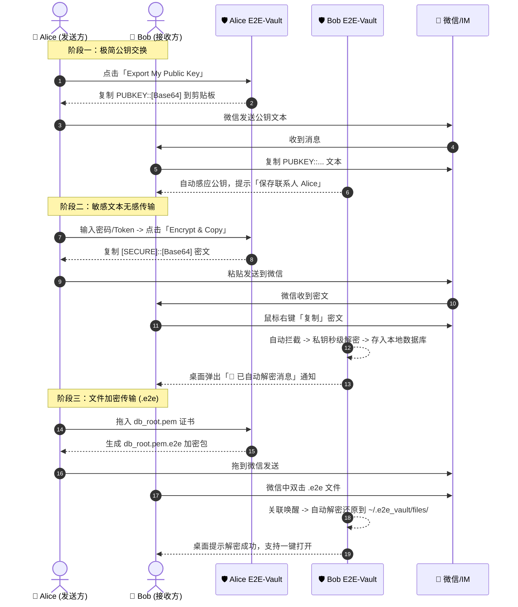

# 🛡️ E2E-Vault: Desktop End-to-End Encrypted Vault for Instant Messaging

<div align="center">

[](LICENSE)
[](#)
[](https://tauri.app)
[](https://www.rust-lang.org)
[](https://reactjs.org)
[](https://tailwindcss.com)

**一款专为微信、企业微信、钉钉等即时通讯工具设计的桌面端端到端加密（E2EE）保险库。**  
*A native, privacy-first desktop vault to seamlessly encrypt/decrypt sensitive text and credentials over untrusted IM channels.*

[中文文档](#-中文说明) | [English Documentation](#-english-guide) | [下载安装 (Releases)](https://github.com/bigbowl99/E2E-Vault/releases)

</div>

---

## 🇨🇳 中文说明

### 🌟 为什么需要 E2E-Vault？
在日常团队协作与即时通讯中，我们经常需要在微信等普通聊天工具中发送密码、API Token、SSH 私钥、数据库配置等敏感信息。但明文发送存在巨大的泄漏与合规风险。

**E2E-Vault** 充当你的本地安全卫士：
- **无感秒级加解密**：后台实时监听剪贴板，复制到微信密文即自动秒级解密，弹出系统通知。
- **真正的端到端加密（Zero-Knowledge）**：基于椭圆曲线 **X25519** 密钥协商 + **AES-256-GCM** 认证加密，无需中心服务器，私钥仅保存在本地。
- **文件打包传输 (`.e2e`)**：支持证书、密钥及配置文件拖拽打包为 `.e2e` 加密格式，双击即可无感还原。
- **本地 SQLite 安全归档**：所有收发的机密文本与文件结构化存储在本地数据库中，支持秒级全文检索与标签管理。

---

### 🚀 核心工作流



---

### 💻 下载与安装

请前往 [GitHub Releases](https://github.com/bigbowl99/E2E-Vault/releases) 页面下载对应系统的最新安装包：

| 系统平台 | 下载文件 | 说明 |
| :--- | :--- | :--- |
| **macOS (Apple Silicon M1/M2/M3/M4)** | `E2E-Vault_aarch64.dmg` | 适用于所有现代 Mac 电脑，双击拖拽到 Applications 即可 |
| **macOS (Intel)** | `E2E-Vault_x64.dmg` | 适用于 Intel 架构的 Mac 电脑 |
| **Windows 10/11 (安装版，推荐)** | `E2E-Vault-Setup-v0.1.0.exe` | 自动配置 `.e2e` 文件格式关联 |
| **Windows (绿色单文件免安装版)** | `E2E-Vault-Portable.exe` | 免安装，双击直接运行 |

---

### 🔒 密码学与安全规范

- **非对称密钥交换**: X25519 (Curve25519 Diffie-Hellman) 32-byte Keypair
- **对称加密算法**: AES-256-GCM (带 128-bit 认证标签，防篡改)
- **临时会话密钥**: 每次加密均动态生成 Ephemeral X25519 密钥对与 12 字节随机 Nonce，保证前向保密性。
- **本地存储位置**:
  - 本地私钥: `~/.e2e_vault/keys/identity.json`
  - 本地 SQLite 数据库: `~/.e2e_vault/vault.db`
  - 解密文件目录: `~/.e2e_vault/files/`

---

## 🇬🇧 English Guide

### Overview
**E2E-Vault** is a lightweight desktop utility designed to securely transfer sensitive credentials (passwords, tokens, SSH keys, configuration files) across unencrypted or corporate-monitored instant messaging apps like WeChat.

### Key Features
- **Zero-Friction Clipboard Integration**: Background daemon intercepts `[SECURE]::` and `PUBKEY::` strings in clipboard, decrypts them automatically, and displays desktop notifications.
- **Pure Local Encryption**: All cryptographic operations execute exclusively in native Rust. No cloud services or web crypto dependencies.
- **Secure File Packaging (`.e2e`)**: Encrypts files (< 100MB) into `.e2e` containers. Double-clicking incoming `.e2e` files restores original files into the local vault folder.
- **Built-in Local Vault**: SQLite database organizes encrypted and decrypted history with full-text search and tagging.

---

## 🛠️ 本地开发与构建指南 (Build from Source)

### 环境依赖 (Prerequisites)
1. **Node.js**: >= 18.x
2. **Rust**: >= 1.77.x (`rustup default stable`)
3. **C++ Build Tools**: MSVC (Windows) 或 Xcode Command Line Tools (macOS)

### 快速启动 (Development)
```bash
# 1. 克隆代码仓库
git clone https://github.com/bigbowl99/E2E-Vault.git
cd E2E-Vault

# 2. 安装前端依赖
npm install

# 3. 启动开发模式（热重载）
npm run tauri dev
```

### 运行测试 (Run Tests)
```bash
# 运行 Rust 后端密码学与数据库单元测试
cd src-tauri
cargo test
```

### 生产打包 (Production Build)
```bash
# 编译生成当前系统的安装包及可执行文件
npm run tauri build
```

---

## 📄 License
This project is licensed under the [MIT License](LICENSE).